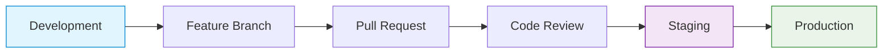

# 🚀 cIV - Modern Product Website

[](https://github.com/continuous-intelligence/cIV/actions)
[](https://www.typescriptlang.org/)
[](https://nextjs.org/)
[](https://tailwindcss.com/)
[](LICENSE)

**cIV** is a modern, dynamic single-page product website **currently in early development**. The project is being built with cutting-edge technologies to deliver exceptional user experiences with seamless content management capabilities.

> **⚠️ Development Status**: This project is in the **foundation phase**. Core setup is complete, but main features (Sanity CMS, custom pages, etc.) are not yet implemented.

## 📋 Project Overview

A comprehensive single-page application that will showcase product information through:

- **🎯 Splash Screen** - Engaging entry point with dynamic branding _(Planned)_
- **🏠 Landing Page** - Feature-rich product showcase _(Planned)_
- **📝 Blog Page** - Content hub with dynamic posts _(Planned)_

## 🛠️ Tech Stack

### **Current Implementation**

- **[Next.js 15](https://nextjs.org/)** - React framework with App Router ✅
- **[TypeScript](https://www.typescriptlang.org/)** - Type-safe development ✅
- **[Tailwind CSS v4](https://tailwindcss.com/)** - Utility-first styling ✅
- **[Shadcn UI](https://ui.shadcn.com/)** - Component library foundation ✅
- **[Sentry](https://sentry.io/)** - Error monitoring ✅

### **Planned Integrations**

- **[Sanity CMS](https://www.sanity.io/)** - Headless content management ⏳
- **[Framer Motion](https://www.framer.com/motion/)** - Smooth animations ⏳
- **[GROQ](https://www.sanity.io/docs/groq)** - Graph-Relational Object Queries ⏳

### **Development & Deployment**

- **[GitHub Actions](https://github.com/features/actions)** - CI/CD pipeline ✅
- **[Vercel](https://vercel.com/)** - Production deployment ⏳
- **[Doppler](https://doppler.com/)** - Environment management ⏳

## 🚧 Current Status

| Feature                    | Status         | Notes                              |
| -------------------------- | -------------- | ---------------------------------- |
| **Next.js Setup**          | ✅ Complete    | App Router, TypeScript, ESLint     |
| **Tailwind CSS**           | ✅ Complete    | v4 configured with proper setup    |
| **Shadcn UI**              | ✅ Basic Setup | Button component only              |
| **Git Repository**         | ✅ Complete    | Branch protection, CI/CD workflows |
| **GitHub Actions CI/CD**   | ✅ Complete    | Quality checks, build workflows    |
| **Sentry Integration**     | ✅ Complete    | Error tracking configured          |
| **Sanity CMS Integration** | ✅ Complete    | Schemas deployed, dummy data added |
| **Splash Screen**          | ⏳ In Progress | Schema ready, needs page implementation |
| **Landing Page**           | ⏳ In Progress | Schema ready, needs page implementation |
| **Blog Page**              | ⏳ In Progress | Schema ready, needs page implementation |
| **Real-time Preview**      | ⏳ Not Started | Sanity Studio configured at /studio |
| **Production Deployment**  | ⏳ Not Started | No live site yet                   |

## 📚 Documentation

Comprehensive documentation is available in our **[GitHub Wiki](https://github.com/continuous-intelligence/cIV/wiki)**:

### 🚀 **Getting Started**

- **[Setup Instructions](https://github.com/continuous-intelligence/cIV/wiki/Setup-Instructions)** - Complete development environment setup
- **[Architecture](https://github.com/continuous-intelligence/cIV/wiki/Architecture)** - Technical architecture and design decisions

### 🔧 **Development**

- **[Component Library](https://github.com/continuous-intelligence/cIV/wiki/Component-Library)** - UI components and patterns
- **[API Documentation](https://github.com/continuous-intelligence/cIV/wiki/API-Documentation)** - Backend API reference
- **[Testing](https://github.com/continuous-intelligence/cIV/wiki/Testing)** - Testing strategies and guidelines

### 🚀 **Deployment**

- **[Deployment Guide](https://github.com/continuous-intelligence/cIV/wiki/Deployment)** - Production deployment process
- **[Environment Management](https://github.com/continuous-intelligence/cIV/wiki/Environment-Management)** - Environment setup and configuration
- **[Monitoring](https://github.com/continuous-intelligence/cIV/wiki/Monitoring)** - Performance and error tracking

## 🚀 Quick Start

```bash
# Clone the repository
git clone git@github.com:continuous-intelligence/cIV.git
cd cIV

# Install dependencies
npm install

# Start development server
npm run dev
```

### 🧪 Testing Sanity Integration

To verify the Sanity CMS integration is working:

1. **Visit the test page**: `http://localhost:3000/test-sanity`
2. **Access Sanity Studio**: `http://localhost:3000/studio`
3. **API Test**: `http://localhost:3000/api/test-sanity`

The integration includes:
- ✅ **Settings** - Global site configuration
- ✅ **Authors** - Author profiles with social links
- ✅ **Splash Screen** - Configurable splash screen
- ✅ **Landing Page** - Dynamic landing page content
- ✅ **Blog Posts** - Rich content with Portable Text

**For detailed setup instructions, please visit our [Setup Guide](https://github.com/continuous-intelligence/cIV/wiki/Setup-Instructions).**

## 🌿 Development Workflow

We follow a structured three-branch development model:

- **`main`** - Production-ready code
- **`staging`** - Pre-production testing
- **`development`** - Active development

### Contributing

1. Fork the repository
2. Create a feature branch from `development`
3. Make your changes with tests
4. Submit a pull request
5. Follow the code review process

**For detailed workflow information, see our [Git Workflow Guide](https://github.com/continuous-intelligence/cIV/wiki/Git-Workflow).**

## 🔒 Branch Protection & CI/CD

### Automated Quality Assurance

Our repository uses **GitHub Actions** for continuous integration and deployment:

- **Development CI**: Runs on all pushes to `development` branch
  - ESLint code linting
  - TypeScript type checking
  - Prettier format validation
  - Build verification
  - Bundle size analysis

- **Staging Deployment**: Automated deployment to staging environment
  - Quality checks before deployment
  - Automatic staging environment updates
  - Deployment status notifications

- **Production Deployment**: Handled by Vercel's native CI/CD
  - Automatic production deployments on `main` branch
  - Environment variable management via Vercel dashboard

### Branch Protection Rules

| Branch        | Status Checks Required  | Review Requirements | Direct Push |
| ------------- | ----------------------- | ------------------- | ----------- |
| `development` | None                    | None                | ✅ Allowed  |
| `staging`     | All CI checks           | 1 reviewer          | ❌ Blocked  |
| `main`        | CI + Staging deployment | 2 reviewers         | ❌ Blocked  |

### Development Workflow



**Setup Instructions:**

- **[Branch Protection Setup](docs/branch-protection-setup.md)** - Configure GitHub branch protection rules
- **[GitHub Actions Secrets](docs/github-actions-secrets.md)** - Set up deployment credentials

## 🔗 Links

- **[Live Site](https://civ.app)** - Production website _(when deployed)_
- **[Staging Site](https://staging.civ.app)** - Pre-production testing _(when deployed)_
- **[Sanity Studio](https://civ-studio.sanity.studio)** - Content management _(when configured)_
- **[GitHub Wiki](https://github.com/continuous-intelligence/cIV/wiki)** - Complete documentation

## 🤝 Support

If you encounter any issues or have questions:

1. **Check the [Wiki](https://github.com/continuous-intelligence/cIV/wiki)** for documentation
2. **Search [existing issues](https://github.com/continuous-intelligence/cIV/issues)** for similar problems
3. **Create a [new issue](https://github.com/continuous-intelligence/cIV/issues/new)** with detailed information
4. **Join the [discussion](https://github.com/continuous-intelligence/cIV/discussions)** for general questions

## 📄 License

This project is proprietary and confidential. All rights reserved by **[Continuous Intelligence](https://github.com/continuous-intelligence)**.

---

**Built with ❤️ by the Continuous Intelligence team.**
