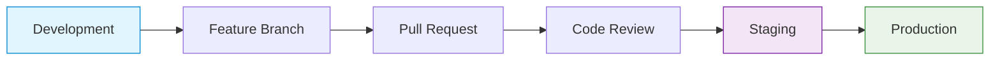

# 🚀 cIV - Dynamic Product Website

[](https://github.com/continuous-intelligence/cIV/actions)
[](LICENSE)
[](https://github.com/continuous-intelligence/cIV/releases)

**A modern, dynamic single-page product website built with cutting-edge technologies to deliver exceptional user experiences with seamless content management capabilities.**

## 🌟 Project Overview

cIV is a comprehensive single-page application designed to showcase product information through three beautifully crafted sections:

- **🎯 Splash Screen** - Engaging entry point with dynamic branding
- **🏠 Landing Page** - Feature-rich product showcase with dynamic sections
- **📝 Blog Page** - Content hub supporting both blog posts and micro-writing

## ✨ Key Features

### 🎨 **Modern UI/UX**
- Responsive design optimized for all device sizes
- Beautiful, accessible interface using Shadcn UI components
- Smooth animations and transitions
- Modern typography and color schemes

### 🔧 **Content Management**
- **Fully Dynamic Content** - All website content manageable through Sanity CMS
- **Real-time Updates** - Content changes reflect instantly without code modifications
- **Rich Media Support** - Optimized image handling and rich text editing
- **Preview Mode** - Live content preview for editors

### 🚀 **Performance & SEO**
- **Static Site Generation** - Lightning-fast loading times
- **Image Optimization** - Automatic image compression and responsive images
- **SEO Optimized** - Dynamic meta tags and structured data
- **Progressive Web App** - App-like experience with offline capabilities

### 🔒 **Enterprise-Grade Development**
- **Type Safety** - Full TypeScript implementation
- **Code Quality** - ESLint, Prettier, and automated testing
- **CI/CD Pipeline** - Automated deployment and quality checks
- **Branch Protection** - Secure development workflow

## 🛠️ Technology Stack

### **Frontend**
- **[Next.js 15](https://nextjs.org/)** - React framework with App Router
- **[TypeScript](https://www.typescriptlang.org/)** - Type-safe JavaScript
- **[Tailwind CSS v4](https://tailwindcss.com/)** - Utility-first CSS framework
- **[Shadcn UI](https://ui.shadcn.com/)** - Beautiful, accessible components

### **Backend & CMS**
- **[Sanity CMS](https://www.sanity.io/)** - Headless content management
- **[Next.js API Routes](https://nextjs.org/docs/api-routes/introduction)** - Server-side functionality
- **[GROQ](https://www.sanity.io/docs/groq)** - Graph-Relational Object Queries

### **Development & Deployment**
- **[Vercel](https://vercel.com/)** - Deployment and hosting
- **[GitHub Actions](https://github.com/features/actions)** - CI/CD pipeline
- **[Doppler](https://www.doppler.com/)** - Environment management
- **[Sentry](https://sentry.io/)** - Error monitoring

## 🎯 Project Status

| Feature | Status |
|---------|--------|
| **Next.js Setup** | ✅ Complete |
| **Git Repository** | ✅ Complete |
| **Sanity CMS Integration** | 🔄 In Progress |
| **Splash Screen** | ⏳ Pending |
| **Landing Page** | ⏳ Pending |
| **Blog Page** | ⏳ Pending |
| **Real-time Preview** | ⏳ Pending |
| **GitHub Actions CI/CD** | ⏳ Pending |
| **Production Deployment** | ⏳ Pending |

## 📚 Documentation

Comprehensive documentation is available in our **[GitHub Wiki](https://github.com/continuous-intelligence/cIV/wiki)**:

### 🚀 **Getting Started**
- **[Setup Instructions](https://github.com/continuous-intelligence/cIV/wiki/Setup-Instructions)** - Complete development environment setup
- **[Architecture](https://github.com/continuous-intelligence/cIV/wiki/Architecture)** - Technical architecture and design decisions
- **[Git Workflow](https://github.com/continuous-intelligence/cIV/wiki/Git-Workflow)** - Development workflow and branching strategy

### 🔧 **Development**
- **[Component Library](https://github.com/continuous-intelligence/cIV/wiki/Component-Library)** - UI components and patterns
- **[API Documentation](https://github.com/continuous-intelligence/cIV/wiki/API-Documentation)** - Backend API reference
- **[Testing](https://github.com/continuous-intelligence/cIV/wiki/Testing)** - Testing strategies and guidelines

### 🚀 **Deployment**
- **[Deployment Guide](https://github.com/continuous-intelligence/cIV/wiki/Deployment)** - Production deployment process
- **[Environment Management](https://github.com/continuous-intelligence/cIV/wiki/Environment-Management)** - Environment setup and configuration
- **[Monitoring](https://github.com/continuous-intelligence/cIV/wiki/Monitoring)** - Performance and error tracking

## 🚀 Quick Start

```bash
# Clone the repository
git clone git@github.com:continuous-intelligence/cIV.git
cd cIV

# Install dependencies
npm install

# Start development server
npm run dev
```

**For detailed setup instructions, please visit our [Setup Guide](https://github.com/continuous-intelligence/cIV/wiki/Setup-Instructions).**

## 🌿 Development Workflow

We follow a structured three-branch development model:

- **`main`** - Production-ready code
- **`staging`** - Pre-production testing
- **`development`** - Active development

### Contributing
1. Fork the repository
2. Create a feature branch from `development`
3. Make your changes with tests
4. Submit a pull request
5. Follow the code review process

**For detailed workflow information, see our [Git Workflow Guide](https://github.com/continuous-intelligence/cIV/wiki/Git-Workflow).**

## 🔒 Branch Protection & CI/CD

### Automated Quality Assurance

Our repository uses **GitHub Actions** for continuous integration and deployment:

- **Development CI**: Runs on all pushes to `development` branch
  - ESLint code linting
  - TypeScript type checking
  - Prettier format validation
  - Build verification
  - Bundle size analysis

- **Staging Deployment**: Automated deployment to staging environment
  - Quality checks before deployment
  - Automatic staging environment updates
  - Deployment status notifications

- **Production Deployment**: Handled by Vercel's native CI/CD
  - Automatic production deployments on `main` branch
  - Environment variable management via Vercel dashboard

### Branch Protection Rules

| Branch | Status Checks Required | Review Requirements | Direct Push |
|--------|----------------------|-------------------|-------------|
| `development` | None | None | ✅ Allowed |
| `staging` | All CI checks | 1 reviewer | ❌ Blocked |
| `main` | CI + Staging deployment | 2 reviewers | ❌ Blocked |

### Development Workflow



**Setup Instructions:**
- **[Branch Protection Setup](docs/branch-protection-setup.md)** - Configure GitHub branch protection rules
- **[GitHub Actions Secrets](docs/github-actions-secrets.md)** - Set up deployment credentials

## 🔗 Links

- **[Live Site](https://civ.app)** - Production website *(when deployed)*
- **[Staging Site](https://staging.civ.app)** - Pre-production testing *(when deployed)*
- **[Sanity Studio](https://civ-studio.sanity.studio)** - Content management *(when configured)*
- **[GitHub Wiki](https://github.com/continuous-intelligence/cIV/wiki)** - Complete documentation

## 🤝 Support

If you encounter any issues or have questions:

1. **Check the [Wiki](https://github.com/continuous-intelligence/cIV/wiki)** for documentation
2. **Search [existing issues](https://github.com/continuous-intelligence/cIV/issues)** for similar problems
3. **Create a [new issue](https://github.com/continuous-intelligence/cIV/issues/new)** with detailed information
4. **Join the [discussion](https://github.com/continuous-intelligence/cIV/discussions)** for general questions

## 📄 License

This project is proprietary and confidential. All rights reserved by **[Continuous Intelligence](https://github.com/continuous-intelligence)**.

---

**Built with ❤️ by the Continuous Intelligence team.**
